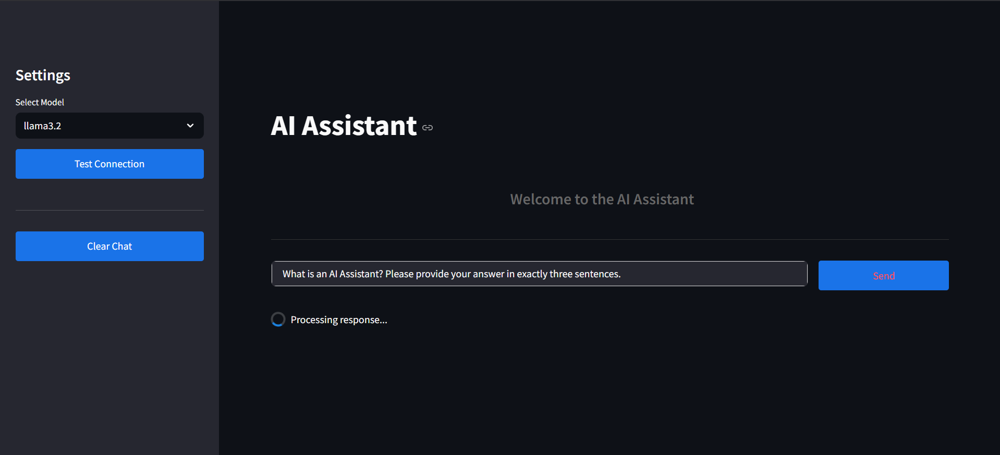
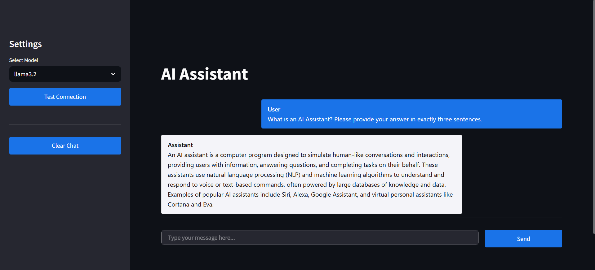

# 🤖 AI Assistant with Ollama 

*A conversational AI assistant powered by local LLMs (LLaMA, etc.) and a sleek Streamlit web interface.*

  
  

## ✨ Features  
- 💬 Human-like Q&A using Ollama's local models (supports LLaMA, Mistral, etc.)  
- 🖥️ Streamlit-based web UI for easy interaction  
- ⚡ Test/switch models on the fly (see demo above →)  
- 🧹 Chat history management  
- 🔌 Simple API-like connection testing  

## 🛠️ Tech Stack  
- **Ollama** (for local model inference)  
- **Streamlit** (frontend interface)  
- **Python 3.10+**  